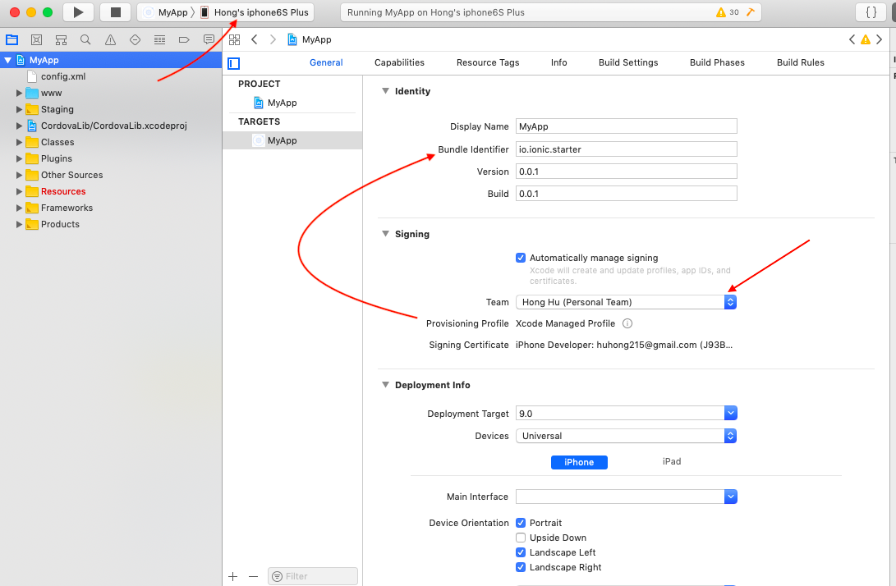

# Ionic 4 with Firebase Mobile app starter demo

## Installation

1. clone file and build

    ```
    git clone https://github.com/honghu215/IonicFirebase-starter.git
    cd folder
    npm i
    ionic cordova platform add ios
    ionic cordova prepare ios
    ```

2. run app on XCode

    1.   
        Open XCode and connect your iphone
    1. 
        * Make sure you connected your device
        * select your team
        * change the bundle identifier so that xcode can properly create provisioning file and certificate
        * go to File -> Project Settings, select Legacy Build System under Build System options
        
    1. run!
